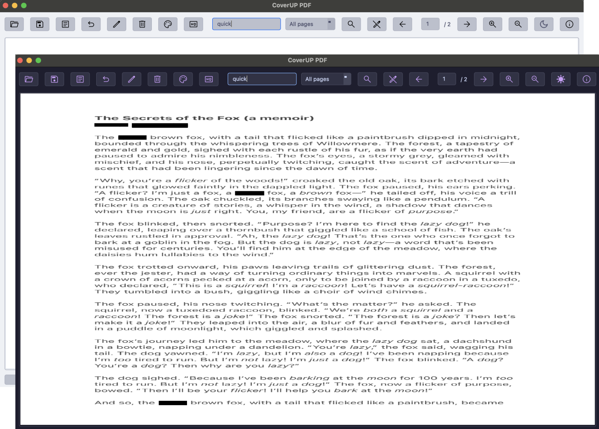

# CoverUP PDF Redaction Software
---
A fork of CoverUp using a different python UI library, PyQt6.
<p align="center">
  
</p>
## 🧪 Installation

- Make sure you have uv installed: https://docs.astral.sh/uv/
- Clone the repo: `git clone https://github.com/64MM4-KN1F3/CoverUP.git`
- Sync packages:
```shell
cd CoverUp
uv venv
uv sync
```
## 🚀 Running the App

The CoverUP application is now fully converted to PyQt6 and can be run with:
```shell
uv run coverup
```
The application includes all the enhanced features:

- PDF redaction with rectangle drawing
- OCR-based text search and redaction
- Search across all pages or current page only
- Regex pattern support
- High/low quality output options
- Undo functionality

*The original readme follows:*
---
**CoverUP** is a free software, developed in Python, designed to provide a secure and straightforward method for redacting PDF files. It enables users to conceal sensitive text passages by overlaying them with black or white bars.

Users can import PDF documents into CoverUP, which are then converted into images. This conversion process ensures that the text cannot be copied from the document or indexed without OCR, enhancing the security of your information. Additionally, invisible layers within the PDF are not converted, providing an extra layer of security.

It also supports the import of PNG and JPG files, in addition to PDFs

Given that image-based PDFs can become quite large, **CoverUP** offers two modes: a high-quality mode that maintains the visual fidelity of the document, and a compressed mode that reduces file size redacted PDF at the expense of some visual quality.

Whether you’re dealing with a single page or an entire document, **CoverUP** provides a flexible and easy solution for all your PDF redaction needs.

Linux users can install the software directly from the snap store:

[](https://snapcraft.io/coverup)

[](https://snapcraft.io/coverup)

[Windows Installer and other download options](https://github.com/digidigital/CoverUP/releases/latest)

----
# Schwärzen von PDF Dokumenten mit CoverUP 
**CoverUP** ist eine kostenlose Software, die in Python entwickelt wurde, um eine sichere und unkomplizierte Methode zur Schwärzung von PDF-Dateien bereitzustellen. Sie ermöglicht es den Benutzern, sensible Textpassagen zu verbergen, indem sie diese mit schwarzen oder weißen Balken überlagern.

Benutzer können PDF-Dokumente in **CoverUP** importieren, die dann in Bilder umgewandelt werden. Dieser Umwandlungsprozess stellt sicher, dass der Text nicht ohne zusätzliche Texterkennung kopiert oder indexiert werden kann, was die Sicherheit der Informationen erhöht. Zusätzlich werden unsichtbare Schichten innerhalb der PDF nicht konvertiert, was eine zusätzliche Sicherheitsebene gegen versehentliche Veröffentlichung bietet.

Es unterstützt auch den Import von PNG- und JPG-Dateien, zusätzlich zu PDFs.

Da bildbasierte PDFs recht groß werden können, bietet CoverUP zwei Exportoptonen an: einen Modus in hoher Qualität, der die visuelle Genauigkeit des Dokuments weitesthegend beibehält, und einen komprimierten Modus, der die Dateigröße der exportierten PDF-Datei auf Kosten von visueller Qualität reduziert.

Ob Sie mit einer einzelnen Seite oder einem gesamten Dokument arbeiten, **CoverUP** bietet eine flexible und einfache Lösung für alle Ihre Bedürfnisse zur Schwärzung von PDFs.

Linux Nutzer können die Software direkt aus dem Snap Store installieren:

[](https://snapcraft.io/coverup)

[](https://snapcraft.io/coverup)

[Windows Installer und andere Downloadoptionen](https://github.com/digidigital/CoverUP/releases/latest)

---


